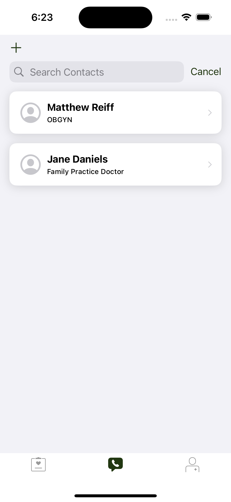

# CareKitSample+ParseCareKit
     

# Introduction
I've developed a unique self-help application named 'Self Help Buddy,' aimed at providing comprehensive support and resources for personal development and mental well-being. Unlike traditional self-help apps that may focus on a single aspect of well-being, EmpowerYou offers a diverse range of tools and content to address various areas of a user's life.

Self Help Buddy's core features include mood tracking, stress management techniques, guided meditation, and educational resources covering topics from emotional intelligence to effective communication skills. One of the standout aspects of this app is its personalized approach. Users can set their goals, whether it's improving self-esteem, managing anxiety, or developing better relationships, and the app tailors its content and recommendations accordingly.

Furthermore, Self Help buddy recognizes the importance of holistic well-being. It integrates physical health tips and routines, understanding that physical health significantly impacts mental health. It also offers a community feature, where users can share their journeys and support each other, fostering a sense of connection and mutual growth.

# Demo Video

<a href="https://youtu.be/XoOzIgeo5d0
" target="_blank">Demo Video</a>

# Designed for Users
Self Help Buddy' is an innovative self-help application designed to provide comprehensive support and guidance for individuals seeking personal growth and mental well-being. This app stands out in the crowded field of self-help tools by offering a wide range of features tailored to meet the diverse needs of its users.

The app includes mood tracking, stress management techniques, and guided meditation sessions, catering to those who are looking to improve their mental health and emotional resilience. Additionally, it offers educational resources on topics like emotional intelligence, time management, and inter personal communication, making it an invaluable tool for personal development.

'Self Help Buddy' is unique in its approach to personalization. Users can set specific goals, such as boosting self-confidence, managing anxiety, or building stronger relationships. The app then customizes its content and suggestions to align with these individual objectives, providing a more targeted and effective self-help experience.

  

**Similar to the [What's New in CareKit](https://developer.apple.com/videos/play/wwdc2020/10151/) WWDC20 video, this app syncs between data between iOS and an Apple Watch (setting the flag `isSyncingWithRemote` in `Constants.swift` to  `isSyncingWithRemote = false`. Different from the video, setting `isSyncingWithRemote = true` (default behavior) in the aforementioned file syncs iOS and watchOS to a Parse Server.**

ParseCareKit synchronizes the following entities to Parse tables/classes using [Parse-Swift](https://github.com/netreconlab/Parse-Swift):

- [Yes] OCKTask <-> Task
- [Yes] OCKHealthKitTask <-> HealthKitTask 
- [Yes] OCKOutcome <-> Outcome
- [Yes] OCKPatient <-> Patient
- [Yes] OCKCarePlan <-> CarePlan
- [Yes] OCKContact <-> Contact

**Use at your own risk. There is no promise that this is HIPAA compliant and we are not responsible for any mishandling of your data**

# Developed By
- Corey Baker
- Ayush Khanal

## Contributions/Features
There are 2 new OCKCarePlans for tracking moth PhysicalHealth and MentalHealth. With that several OCKTasks relating to either physical well being or mental well being are provided to get a unified view of the person's state. Searchable contacts with adding possibilites, profile pictures that change, and all the data gets preserved for the next session.

# Check List
- [ X] Signup/Login screen tailored to app
- [ X] Signup/Login with email address
- [ X] Custom app logo
- [ X] Custom styling
- [ X] Add at least 5 new OCKTask/OCKHealthKitTasks to your app
- [ X] Have a minimum of 7 OCKTask/OCKHealthKitTasks in your app
- [ X] 3/7 of OCKTasks should have different OCKSchedules than what's in the original app
- [ X] Use at least 5/7 card below in your app
- [ X] InstructionsTaskView - typically used with a OCKTask
- [ ] SimpleTaskView - typically used with a OCKTask
- [ X] Checklist - typically used with a OCKTask
- [ X] Button Log - typically used with a OCKTask
- [ ] GridTaskView - typically used with a OCKTask
- [ X] NumericProgressTaskView (SwiftUI) - typically used with a OCKHealthKitTask
- [ ] LabeledValueTaskView (SwiftUI) - typically used with a OCKHealthKitTask
- [ X] Add the LinkView (SwiftUI) card to your app
- [ X] Replace the current TipView with a class with CustomFeaturedContentView that subclasses OCKFeaturedContentView. This card should have an initializer which takes any link
- [ ] Tailor the ResearchKit Onboarding to reflect your application
- [ ] Add tailored check-in ResearchKit survey to your app
- [ ] Add a new tab called "Insights" to MainTabView
- [X] Replace current ContactView with Searchable contact view
- [X] Change the ProfileView to use a Form view
- [X] Add at least two OCKCarePlan's and tie them to their respective OCKTask's and OCContact's

## Wishlist features
<!--
Describe at least 3 features you want to add in the future before releasing your app in the app-store
-->
1. A comparison between the happy and sad tally in a multi timescale horizon. We can see the avg happy to sad across time periods.
2. Trying to tie in the health data like steps and heartRate into the how the mental health treds get shaped with excercise.
3. Interactive feedback in the tip view depending on the health trends captured by the app.
4. More granular tracking of both physical and mental health data points for even more chances of integration and providing unique insights.

## Challenges faced while developing
<!--
Describe any challenges you faced with learning Swift, your baseline app, or adding features. You can describe how you overcame them.
-->
The biggest challenges with this project was trying to find good example code to browse for CareKit and HealthKit as well as the learning curve of creative ideation of a wellness app which tracks not any arbritiary stats but rather a unified, connected, and intertwined set of metrics which can be cross analyzed to get useful actionable data. I also ran into IDE issues with xcode sometimes disagreeing about versions or Network issues trying to connect to the heroku server, etc.

## Setup Your Parse Server

### Heroku
The easiest way to setup your server is using the [one-button-click](https://github.com/netreconlab/parse-hipaa#heroku) deployment method for [parse-hipaa](https://github.com/netreconlab/parse-hipaa).

## Fork this repo to get the modified OCKSample app

1. Fork [CareKitSample-ParseCareKit](https://github.com/netreconlab/ParseCareKit)
2. Open `OCKSample.xcodeproj` in Xcode
3. You may need to configure your "Team" and "Bundle Identifier" in "Signing and Capabilities"
4. Run the app and data will synchronize with parse-hipaa via http://localhost:1337/parse automatically
5. You can edit Parse server setup in the ParseCareKit.plist file under "Supporting Files" in the Xcode browser

## View your data in Parse Dashboard

### Heroku
The easiest way to setup your dashboard is using the [one-button-click](https://github.com/netreconlab/parse-hipaa-dashboard#heroku) deployment method for [parse-hipaa-dashboard](https://github.com/netreconlab/parse-hipaa-dashboard).

Note that CareKit data is extremely sensitive and you are responsible for ensuring your parse-server meets HIPAA compliance.

## Transitioning the sample app to a production app
If you plan on using this app as a starting point for your produciton app. Once you have your parse-hipaa server in the Cloud behind ssl, you should open `ParseCareKit.plist` in Xcode and change the value for `Server` to point to your server(s) in the Cloud. You should also open `Info.plist` in Xcode and remove `App Transport Security Settings` and any key/value pairs under it as this was only in place to allow you to test the sample app to connect to a server setup on your local machine. iOS apps do not allow non-ssl connections in production, and even if you find a way to connect to non-ssl servers, it would not be HIPAA compliant.

### Extra scripts for optimized Cloud queries
You should run the extra scripts outlined on parse-hipaa [here](https://github.com/netreconlab/parse-hipaa#running-in-production-for-parsecarekit).
